<h1 align="center">
  Hi there, I'm Sora Sawabe🦄
</h1>
<h3 align="center">A Front-end Engineer focused on UX/UI.</h3>

---

### 👨‍💻 About Me

- 🏢 **University:** Faculty of Information Networking for Innovation and Design ([INIAD](https://www.iniad.org/)), Toyo University, 3rd year
- 📚 **Major:** UX/UI Design & Business
- 🎯 **Aspiring to be:** A Front-end Engineer who creates intuitive and engaging user experiences.
- 🌎 **From:** Japan

---

### 🛠️ My Skills & Tools

#### Languages & Frameworks

#### BaaS / Tools

---

### 🚀 Featured Project

  

    <strong>📍 Notepia - Collaborative Mapping Service</strong>
  

   

  

    A web service that allows users to leave notes on a map and share them within a group. Developed during a hackathon
     
    (GEEK-CAMP 2025 Vol.1 / GEEK-HAKU 2025 Vol.2).
  

  
  <strong>🔗Service URL :  </strong>   <a href="https://notepia.cyberhub.jp/" target="_blank">https://notepia.cyberhub.jp/</a>
   
 
  <strong>👤My Responsibilities :</strong>
  <ul>
    <li>Created wireframes for the user interface.</li>
    <li>Improved UI based on user feedback (e.g., repositioned buttons for better accessibility, added a compass for orientation).</li>
    <li>Designed day/night map styles using Mapbox Studio.</li>
    <li>Implemented a feature to automatically switch map styles based on local time.</li>
    <li>Ensured the application was fully responsive.</li>
  </ul>

  <strong>🛠️Tech Stack : </strong>
  
  

---

### 📊 My GitHub Stats

  

